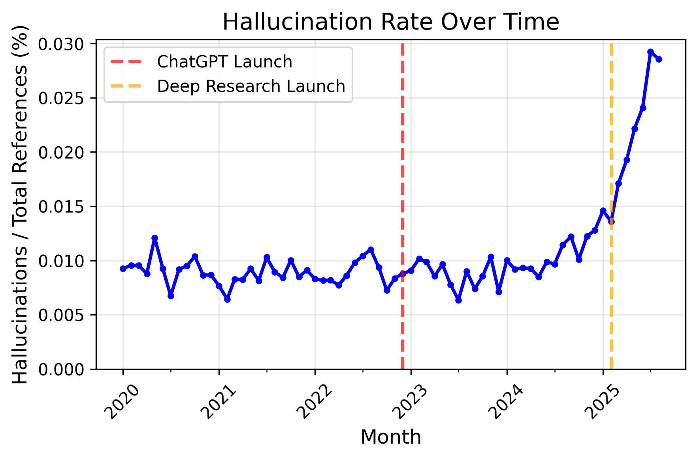

# Check for probably-hallucinated references in arxiv papers

Some vibe-coded scripts (thanks Claude-Code) for finding references in arxiv papers that:
1. match the title of a real arxiv paper
2. have a completely different author list

Some manual checks suggest that most of these references are LLM-hallucinated.

See [this blog post](https://spylab.ai/blog/hallucinations/) for some analysis of the data.



## Dependencies
- [AWS CLI](https://github.com/aws/aws-cli)
- [pdftotext++](https://github.com/ad-freiburg/pdftotext-plus-plus)
- [anystyle](https://github.com/inukshuk/anystyle)
- [anthropic-sdk-python](https://github.com/anthropics/anthropic-sdk-python)

## Steps to acquire the data

1. Download metadata for all arxiv papers (about 1.5GB as of September 2025)

```console
foo@bar:~$ ./dl_arxiv_oai.sh
```

2. build  a much smaller DB (arxiv_papers.json) containing the metadata we actually need

```console
foo@bar:~$ python build_arxiv_db.py
```

3. download all arxiv PDFs since 2000 and extract refs (about 30GB). **WARNING: THIS BILLS YOUR AWS ACCOUNT**

```console
foo@bar:~$ python dl_pdfs_and_extract_refs.py
```

4. find potential hallucinated refs with a bunch of heuristics

```console
foo@bar:~$ python find_hallucinated_refs.py
```

5. filter false positives using Claude. **WARNING: THIS BILLS YOUR ANTHROPIC ACCOUNT**

```console
foo@bar:~$ python filter_hallucinated_refs.py
```

6. plot the results

```console
foo@bar:~$ python show_results.py 
```
